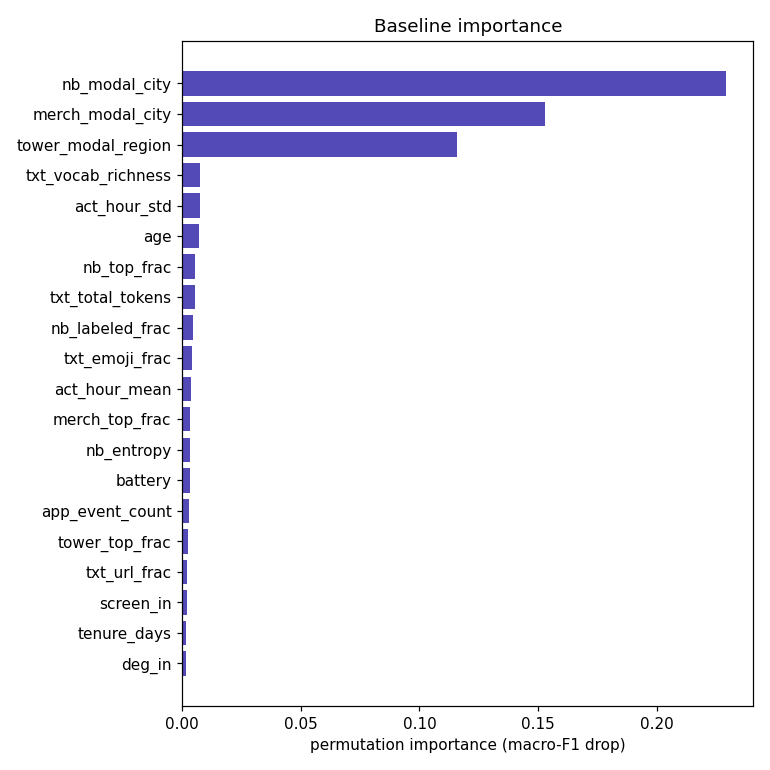

# Breadth Meets Rigor: Automatic Feature Ideation with LLMs

*A closed-loop method for the feature-discovery front of exploratory data analysis — an LLM enumerates the hypothesis space grounded in the real schema, a deterministic harness screens every candidate for real signal, and the human stays at just two gates.*

> **Abstract.** Feature ideation is the slow, judgment-heavy front of classic and graph machine learning: an analyst stares at a schema and tries to remember every family of signal it might hide, while quietly seeding leaks that surface only later. We propose pairing two complementary engines. A large language model supplies *breadth* — it enumerates a wide hypothesis space grounded in the profiled schema, tags each candidate by compute scale, and pre-flags likely leakage. A deterministic harness supplies *rigor* — it screens every candidate against a permutation null, an effect size, incremental model importance, and temporal stability, all under leakage-safe splits. Results loop back into re-ideation. The human appears at exactly two gates: confirming the data wiring and setting the keep threshold. We walk the full loop end to end on a deliberately hard problem — classifying a civilian's home city from a communication graph and nine auxiliary tables. The harness catches a planted leak by its tell-tale signature (one-vs-rest AUC = 1.000; the only feature with non-zero model importance), rejects all thirteen red-herrings against a permutation null, and flags nine near-decisive features for human review. Removing the leak collapses the baseline from a deceptive **macro-F1 = 1.000 to an honest 0.934**, with the residual error landing exactly on the problem's built-in confusable city-pairs.

## The bottleneck

Ask any practitioner where a tabular or graph modeling project actually stalls and the answer is rarely the model. It is the blank page before the model: *what should the features be?* That step — feature ideation, the heart of exploratory data analysis — has three chronic failure modes.

**It is incomplete.** The space of features over a relational schema is large and structured into families: node aggregates, ratios and behavioral *shape* (entropy, coefficient of variation, skew), graph topology and structural role, neighborhood and label-mix features, counterparty diversity, multi-relational joins, timing and timezone proxies, embeddings. No analyst recalls all of them under deadline. Whole families are silently skipped, and you never see the cost — a missing family looks exactly like a family that didn't pan out.

**It is manual and serial.** Each hypothesis is conceived, written, and reasoned about one at a time, bounded by one person's working memory and stamina. The breadth of the search is capped by attention, not by the data.

**It is leak-prone, and the leaks surface late.** The most dangerous features are the ones that quietly encode the answer: a neighbor's label, a per-group attribute joined through the very key you are predicting, an aggregate that spans the prediction cutoff. These look like ordinary features in code. They inflate validation, sail through review, and then either collapse in production (the feature isn't available at predict time) or are caught only when a suspicious metric finally triggers an audit — often after weeks of building on sand.

The common thread: ideation leans on human *recall* (remembering every family) and human *vigilance* (never seeding a leak) — exactly the two things humans are worst at sustaining, and exactly the two things machines are good at in opposite ways.

## The approach

The method is a closed loop with a clean division of labor.

**1 — The LLM enumerates the hypothesis space.** Given the tables profiled on a sample (real column names, dtypes, cardinalities, null rates, candidate join keys — never guessed), the model proposes a wide backlog of feature candidates across every family. Each row is grounded in actual columns, carries a one-line rationale ("why it separates the classes"), a compute sketch, a **scale tag** (cheap node aggregate vs. graph centrality vs. sampled embedding), and a **leakage pre-check**. This is where breadth lives: the model proposes the families a human forgets, in seconds, without fatigue.

**2 — The harness screens every candidate.** Once materialized, each feature is scored by a deterministic panel — no metric trusted alone:

- a **permutation null**: does the feature beat its own shuffled-label distribution, or is it chance?
- an **effect size**: mutual information and best one-vs-rest AUC — is it big enough to matter?
- **incremental importance**: permutation importance inside a baseline model that already has the other features — does it *add* anything, or is it redundant?
- **stability**: is the signal steady across time slices, or an artifact of one slice?

All of it runs under leakage-safe cross-validation. The harness has no recall problem (it scores whatever it is handed) and no imagination (it cannot invent a candidate) — the mirror image of the LLM.

**3 — Results loop back.** Survivors suggest neighbors worth proposing; confirmed dead-ends and noise families are pruned from the next round; anything flagged "suspiciously strong" is sent to a human, not silently kept. Re-ideation is cheap because the backlog format and the harness are fixed.

**The human is at exactly two gates.** First, **confirm the wiring**: which table is edges, which is entities, which is labels; the join keys (edge keys usually differ from the entity key — get this wrong and the whole backlog is garbage); the grain and the time fence. Second, **set the keep threshold** and adjudicate the handful of flagged candidates. Both are low-volume, high-leverage judgments.

### Why this division of labor works

The pairing is complementary precisely where each party is weak:

- **LLM = breadth / recall, low precision.** It is unbeatable at enumerating possibilities and has effectively read the feature-engineering literature, but it cannot tell you whether a proposed feature *actually* carries signal — plausibility is not evidence, and it will argue confidently for noise.
- **Harness = rigor / precision, zero recall.** Deterministic statistics don't get bored, don't get fooled by a good story, and apply the *same* scrutiny to every candidate uniformly. But a harness can only judge what already exists; it proposes nothing.
- **Human = domain priors + judgment, scarce attention.** Two things neither machine can own: grounding the schema in reality (what *is* the label? do edges run source→destination?) and deciding where the keep bar sits and whether a flagged feature is a genuine leak or merely strong. These are rare, consequential calls — the right place for human time.

Each engine's blind spot is another's strength: the LLM's low precision is the harness's whole purpose; the harness's lack of imagination is the LLM's whole purpose; and the two gaps neither can close — schema meaning and risk tolerance — are the human's two gates. Breadth is delegated, rigor is automated, and judgment is concentrated.

## A worked example: who lives where?

To exercise the loop end to end we built a deliberately hard problem: predict each
of 7,000 civilians' `home_city` — five imbalanced classes (≈35 / 25 / 20 / 13 /
8%) — from a communication graph and nine auxiliary tables. The data is generated
([`data/generate_data.py`](https://github.com/Simonomer/mezcal-researcher/blob/main/data/generate_data.py))
with the hardness baked in: only ~63% of a civilian's contacts share their city;
~12% are travelers smeared across cities; cities come in confusable sister-pairs
(A↔B, C↔D) while one (E) stands alone; and a single per-civilian *home affinity*
drives comms, tower pings, and spend together, so a "border" civilian looks
half-sister in **every** channel at once — confusion no amount of feature
combination can resolve.

### The ten tables

| table | role | what it carries |
|---|---|---|
| `comms` | **relevant** | the `caller_id → callee_id` graph (~60k edges) |
| `tower_pings` + `towers` | **strong** | pings → `region_code`; geography, blurred by travelers/noise |
| `transactions` + `merchants` | **partial** | spend → `merchant_city` (null for online merchants) |
| `civilians` | **weak** | age, device, `language_pref` (mildly, overlappingly city-linked) |
| `app_events` | **red-herring** | telemetry; only a faint activity-hour timezone hint |
| `device_info` | **red-herring** | OS / screen / battery — no location signal |
| `weather_logs` | **trap** | per `region_code × date` — joinable to a civilian *only through their region* |
| `home_city` | **label** | the target — never a feature |

### The backlog, then the materialization

Profiling the tables on a sample grounds the candidates in real columns (the
key-scan flags `civ_id` but *not* the dim keys `tower_id` / `merchant_id` — the
human confirms those, since a wrong join key silently poisons everything). The
resulting backlog
([`features/backlog_homecity.md`](https://github.com/Simonomer/mezcal-researcher/blob/main/features/backlog_homecity.md))
spans nine families — neighbor/homophily, tower-region, merchant-city,
activity-timing, language, degree/structural, counterparty diversity, plus the
red-herring and trap controls — every row tagged by compute scale and a leakage
note.

The materialization
([`features/build_features.py`](https://github.com/Simonomer/mezcal-researcher/blob/main/features/build_features.py))
turns 44 features into a `civ_id`-keyed table and enforces the leakage rules **in
code**. The headline feature — the per-city mix of your contacts' cities — is the
textbook leak risk, so it is computed **out-of-fold**: a cross-validation loop
where each civilian's neighbor-city counts use *only training-fold labels*, never
their own and never a test-fold label. It is written as a fold loop, not a global
`groupby`, precisely so that constraint is visible and enforced. The near-leak
tower/merchant aggregates and the deliberately leaky weather join (region annual
mean temperature, attached through the civilian's true home region) are built on
purpose — so the screen has something real to catch.

**In practice this runs on Spark, not pandas.** The local parquet here buys
one-command reproducibility; against a real warehouse the identical loop profiles
*catalog tables* on a bounded cluster-side sample, materializes the feature table
with distributed joins written back to the catalog (the
[`build_features_spark.py`](https://github.com/Simonomer/mezcal-researcher/blob/main/features/build_features_spark.py)
counterpart), and screens it over Spark Connect — pulling only a stratified sample
to the driver for the statistics. The backlog's scale tags (node-aggregate vs.
graph-centrality vs. sampled-embedding) exist precisely to keep that step cheap.

### What the screen found

Run on the full 44-feature table, the harness reports a baseline **macro-F1 =
1.000** (macro-AUC = 1.000). Taken alone, that number says *solved*. It is lying —
and the per-feature panel says exactly why.

The two weather features (`wx_home_region_temp`, `wx_home_region_precip`) carry
near-maximal mutual information (≈1.49), a one-vs-rest **AUC of 1.000**, and are
the **only two features in the entire table with non-zero permutation importance**
(0.28 and 0.32). Every legitimate feature's incremental importance reads exactly
**0.000** — the unmistakable signature of a leak: one feature explains everything,
so nothing else appears to matter. The screen flags both as *“suspiciously strong
— check leakage.”*

In total the harness returns **16 keep · 15 investigate · 13 drop**:

- **Dropped (13) — the red-herrings, correctly rejected.** Every `device_info`
  column (`os_version`, `device_type`, `screen_size`, `battery_health`), the
  app-telemetry volume (`app_event_count`, `app_n_event_types`), `age`, raw degree
  (`deg_out`), and spend volume (`merch_txn_count`, `merch_online_frac`) all fail
  to beat their shuffled-label null. No signal.
- **Flagged (15) — handed to the human, not silently kept.** The 2 weather leaks
  (AUC 1.000); nine near-decisive location features — per-city *neighbor*, *tower*,
  and *merchant* fractions (AUC 0.975–1.000); a **redundant pair** (`deg_total` ↔
  `contact_entropy`, Spearman > 0.9); `act_hour_mean`, flagged **unstable over
  time**; and `nb_label_coverage`, flagged **weak incremental value**.
- **Kept (16).** The modal-city features, the moderately-strong merchant-city
  fractions (AUC 0.92–0.96), `nb_city_entropy`, `deg_in`, `language_pref` — real,
  non-decisive signal.

Crucially, the screen cannot itself tell the genuine leak from the
genuinely-strong-but-legitimate geography: both light up the same AUC alarm. That
adjudication is the human's job — and the harness has shrunk it from 44 features
to 15.

### Closing the loop

The human reads the flags. The weather features are a true leak: `weather_logs`
is keyed by region, and a civilian's region *is* the label — at prediction time
the feature would not exist. They are dropped. The near-decisive neighbor and
tower fractions are legitimate (contacts and pings are observed before, and
independently of, the label), so they are kept with eyes open. We re-screen the
42 honest features:

The honest baseline is **macro-F1 = 0.934** (macro-AUC = 0.994) — and now the
permutation importances are informative: `nb_frac_city_E` (0.075),
`nb_frac_city_B` (0.027), `tower_frac_reg_D` (0.027), `tower_frac_reg_A` (0.019)
lead, exactly the train-only neighbor and tower features the backlog bet on. The
0.066 the leak was hiding is real error, and it is *structured*: the residual
confusion is the sister-city design (A↔B, C↔D), not random noise. In deployment
the gap is larger still — the leaked feature simply would not be available.

That is the loop in one turn: 44 candidates proposed, 13 noise families rejected
against a null, a planted leak caught by its tell-tale AUC and importance
signature, nine near-decisive features surfaced for a human to bless or cut, and
an honest performance number recovered — with the analyst's attention spent only
on confirming the wiring and ruling on fifteen flags.

## Honest limits

This is a screening loop, not a guarantee. Five caveats keep it honest.

- **Screening is not final model evaluation.** The panel ranks *candidates* under cross-validation; it does not certify a deployed model. A kept feature can still underperform out-of-sample, and the only real verdict is full-model performance on held-out data.
- **Univariate signal can mislead — in both directions.** A feature that is weak alone may be strong in combination (interactions the single-feature tests miss), and one that is strong alone may be redundant. The incremental-importance test exists for exactly this, but it is bounded by the baseline model's capacity to express the interaction.
- **Quality is bounded by schema legibility and the wiring gate.** Grounding is only as good as the profiled schema and the human's confirmation of it. Cryptic column names, undocumented keys, or a wrong wiring call degrade everything downstream. That gate is load-bearing, not a formality.
- **The LLM over-proposes.** Recall is bought with precision: a healthy backlog contains noise by design (the device/app/weather controls in the example above). Without the harness to prune, the backlog is just a longer to-do list — and the LLM cannot see leaks that aren't visible in the schema (semantic leaks that require domain knowledge).
- **A flag is not a verdict.** "Suspiciously strong" catches genuine leaks *and* genuinely strong features with the same alarm. The harness shrinks the set a human must adjudicate; it does not eliminate the adjudication.

## Artifacts & links

Everything in the worked example is reproducible from the repository:

- **Data generator** — [`data/generate_data.py`](https://github.com/Simonomer/mezcal-researcher/blob/main/data/generate_data.py)
- **Feature backlog (LLM output)** — [`features/backlog_homecity.md`](https://github.com/Simonomer/mezcal-researcher/blob/main/features/backlog_homecity.md)
- **Materialization (leakage-safe)** — [`features/build_features.py`](https://github.com/Simonomer/mezcal-researcher/blob/main/features/build_features.py)
- **Validation report (harness output)** — [`validation/report.md`](https://github.com/Simonomer/mezcal-researcher/blob/main/validation/report.md)

_Run order: `generate_data.py` → ideate (profile + backlog) → `build_features.py` → `signal_panel.py`. Each step produces a real artifact the next consumes._
