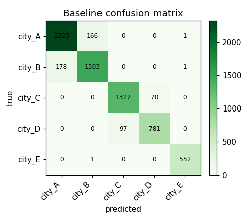

# Breadth Meets Rigor: Automatic Feature Ideation with LLMs

*A closed-loop method for the feature-discovery front of exploratory data analysis: an LLM enumerates the hypothesis space grounded in the real schema, a deterministic harness screens every candidate for real signal, and the human stays at just two gates.*

> **Abstract.** Feature ideation is the slow, judgment-heavy front of classic and graph machine learning. An analyst stares at a schema, tries to recall every family of signal it might hide, and quietly seeds leaks that surface only later. We propose pairing two complementary engines. A large language model supplies *breadth*: it enumerates a wide hypothesis space grounded in the profiled schema, tags each candidate by compute scale, and pre-flags likely leakage. A deterministic harness supplies *rigor*: it screens every candidate against a permutation null, an effect size, incremental model importance, and temporal stability, all under leakage-safe splits. Results loop back into re-ideation. The human appears at exactly two gates: confirming the data wiring and setting the keep threshold. We walk the full loop on a deliberately hard problem. The task is to predict a person's `home_city` over **50 cities, with ground truth for only 30** — a normal-shaped, heavily imbalanced label — from the **text people exchange**, their communication graph, sparse documents, and messy auxiliary tables. The screen rejects 24 red-herrings against a permutation null, flags the near-deterministic features, and ranks the real text, graph, and geography signal. A normalized-MI test catches *categorical* leaks that an AUC test cannot see. The twist: a baseline trained on **all** candidates scores a miserable **macro-F1 = 0.091**, wrecked by high-cardinality leak columns, while removing the three flagged leaks lifts the **same** baseline to **0.845**. The aggregate model score misleads in *both* directions; the per-feature screen tells the truth.

## The bottleneck

Ask any practitioner where a tabular or graph modeling project actually stalls, and the answer is rarely the model. It is the blank page before the model: *what should the features be?* That step is feature ideation, the heart of exploratory data analysis. It has three chronic failure modes.

**It is incomplete.** The space of features over a relational schema is large and structured into families: node aggregates, ratios and behavioral *shape* (entropy, coefficient of variation, skew), graph topology and structural role, neighborhood and label-mix features, counterparty diversity, multi-relational joins, timing and timezone proxies, text content, embeddings. No analyst recalls all of them under deadline. Whole families get silently skipped, and you never see the cost. A missing family looks exactly like a family that didn't pan out.

**It is manual and serial.** Each hypothesis is conceived, written, and reasoned about one at a time, bounded by one person's working memory and stamina. Attention caps the breadth of the search, not the data.

**It is leak-prone, and the leaks surface late.** The most dangerous features quietly encode the answer: a neighbor's label, a per-group attribute joined through the very key you are predicting, a last-seen location, a self-report. These look like ordinary features in code. They sail through review, then fail in one of two ways. Either they collapse in production because the feature isn't available at predict time, or a suspicious metric finally triggers an audit, often after weeks of building on sand.

The common thread is this. Ideation leans on human *recall*, remembering every family, and human *vigilance*, never seeding a leak. Those are exactly the two things humans are worst at sustaining, and exactly the two things machines are good at, in opposite ways.

## The approach

The method is a closed loop with a clean division of labor.

**1 — The LLM enumerates the hypothesis space.** Start by profiling the tables on a sample: real column names, dtypes, cardinalities, null rates, candidate join keys, never guessed. Given that, the model proposes a wide backlog of feature candidates across every family. Each row is grounded in actual columns and carries a one-line rationale ("why it separates the classes"), a compute sketch, a **scale tag** (cheap node aggregate vs. graph centrality vs. sampled embedding), and a **leakage pre-check**. This is where breadth lives. The model proposes the families a human forgets, in seconds, without fatigue.

**2 — The harness screens every candidate.** Once materialized, each feature is scored by a deterministic panel. No metric is trusted alone:

- a **permutation null**: does the feature beat its own shuffled-label distribution, or is it chance?
- an **effect size**: mutual information and best one-vs-rest AUC. Is it big enough to matter?
- **incremental importance**: permutation importance inside a baseline model that already has the other features, with discrete columns used as *native categorical* features rather than arbitrary integer codes. Does it *add* anything, or is it redundant?
- **stability**: is the signal steady across time slices, or an artifact of one slice?

All of it runs under leakage-safe cross-validation. The harness is the mirror image of the LLM: it has no recall problem, since it scores whatever it is handed, and no imagination, since it cannot invent a candidate. Because the per-feature tests are **univariate**, the screen sees signal even when a quick "throw everything into one model" baseline fails to combine it. It also carries two leak detectors. A high one-vs-rest **AUC** catches numeric leaks. A high **normalized MI** — MI divided by label entropy — catches near-deterministic *categorical* leaks, such as an id or self-report column that nearly equals the label. An AUC test, defined only for numerics, would miss those entirely.

**3 — Results loop back.** Survivors suggest neighbors worth proposing. Confirmed dead-ends and noise families are pruned from the next round. Anything flagged "suspiciously strong" is sent to a human, not silently kept. Re-ideation is cheap because the backlog format and the harness are fixed.

**The human is at exactly two gates.** First, **confirm the wiring**: which table is edges, which is entities, which is labels; the join keys (edge keys usually differ from the entity key, and getting this wrong turns the whole backlog to garbage); the grain and the time fence. Second, **set the keep threshold** and adjudicate the handful of flagged candidates. Both are low-volume, high-leverage judgments.

### Why this division of labor works

The pairing is complementary precisely where each party is weak.

- **LLM = breadth / recall, low precision.** It is unbeatable at enumerating possibilities and has effectively read the feature-engineering literature. But it cannot tell you whether a proposed feature *actually* carries signal. Plausibility is not evidence, and it will argue confidently for noise.
- **Harness = rigor / precision, zero recall.** Deterministic statistics don't get bored, don't get fooled by a good story, and apply the *same* scrutiny to every candidate uniformly. But a harness can only judge what already exists; it proposes nothing.
- **Human = domain priors + judgment, scarce attention.** Two things neither machine can own. One is grounding the schema in reality: what *is* the label? Do edges run source→destination? Is this column available at predict time? The other is deciding where the keep bar sits and whether a flagged feature is a genuine leak or merely strong. These are rare, consequential calls, and the right place for human time.

Each engine's blind spot is another's strength. The LLM's low precision is the harness's whole purpose. The harness's lack of imagination is the LLM's whole purpose. And the two gaps neither can close, schema meaning and risk tolerance, are the human's two gates. Breadth is delegated, rigor is automated, judgment is concentrated.

## A worked example: who lives where, from what they say?

To stress the loop we built a deliberately hard, messy problem. The task is to predict a person's
`home_city` across **50 cities**, but with ground truth for only **30** of them.
The other 20 cities' residents appear in the graph and text only as *unlabeled
context*. The 30 labeled classes follow a **normal-shaped, heavily imbalanced**
frequency (counts 14–420, median 134 over 5,240 labeled people out of 9,000). The
signal lives mostly in the **text people exchange**; most messages are noise. The generator
([`data/generate_data.py`](https://github.com/Simonomer/mezcal-researcher/blob/main/data/generate_data.py))
bakes in the difficulty: ~60% of contacts share your city; ~12% travelers; 50
cities grouped into 10 confusable metros; a per-person *home-affinity* that blurs
text, graph, pings, and spend **together**; ~5% label noise; and pervasive mess —
nulls, duplicate rows and edges, inconsistent city casing/typos, mixed types.

### Thirteen messy tables

| table | role | what it carries |
|---|---|---|
| `messages` | **relevant / text** | `sender → recipient` graph **with message text + language** (~78k) |
| `person_docs` | **relevant / text** | sparse free-text documents about ~25% of people |
| `tower_pings` + `towers` | **geo** | pings → metro `region_code` (blurred by travelers/noise) |
| `transactions` + `merchants` | **geo / partial** | spend → `merchant_city` (null online; inconsistent casing) |
| `people` | **mixed / messy** | age, device, language, **self-reported `raw_city_text`** (messy) |
| `app_events`, `device_info` | **red-herring** | telemetry / OS / screen — no location signal |
| `weather_logs` | **trap** | per `region_code × date` — joinable only *through* the region |
| `ip_geo` | **trap** | last-seen IP city — ≈ the answer at a different time |
| `home_city` | **label** | the target — 30 cities, never a feature |

### The backlog, then the materialization

Profiling grounds the candidates in real columns. The human confirms the wiring:
entity `person_id`; edges `messages.sender → recipient`; dim joins on `tower_id`
and `merchant_id`; the label covers only 30 cities. The backlog
([`features/backlog_homecity.md`](https://github.com/Simonomer/mezcal-researcher/blob/main/features/backlog_homecity.md))
spans text-content, document, graph/neighbor, geography, timing, and demographic
families, plus the red-herring and trap controls.

The materialization
([`features/build_features.py`](https://github.com/Simonomer/mezcal-researcher/blob/main/features/build_features.py))
turns 41 features over **all** 9,000 people into a `person_id`-keyed table, so
graph and text context stays complete, and it enforces the leakage rules in code.
Two points need care. First, **text features** are parsed from observable content
only: a per-person modal *city-flavored* token, explicit *city mentions* (a
near-leak), and dominant language. Second, the **neighbor-city** feature is
computed **out-of-fold with only labeled training-fold neighbors**. A person's own
and same-fold labels can never enter, and most neighbors are unlabeled, so coverage
is partial by design. Three leaks are built on purpose so the screen has something
real to catch: `ip_city` (≈ the answer), self-reported `declared_city`, and a
region-joined `weather` feature.

**In practice this runs on Spark, not pandas.** The local parquet here buys
one-command reproducibility. Against a real warehouse, the identical loop profiles
*catalog tables or HDFS/S3 paths* on a bounded cluster-side sample, materializes
the feature table with distributed joins
([`build_features_spark.py`](https://github.com/Simonomer/mezcal-researcher/blob/main/features/build_features_spark.py)),
and screens it over Spark Connect, pulling only a stratified sample to the driver
for the statistics.

### What the screen found

Run on the full 41-feature table, the baseline reports **macro-F1 = 0.091**
(macro-AUC 0.526). Taken alone, that number says *give up — there's nothing here*.
It is lying, and the per-feature panel says exactly why.

The MI ranking is unambiguous. `nb_modal_city` (MI 2.61), `merch_modal_city`
(2.49), `ip_city` (2.21), `tower_modal_region` (2.00), `txt_flavor_top_city`
(1.72), and `declared_city` (1.56) all carry enormous signal. The normalized-MI leak
test flags the two strongest, `nb_modal_city` (ratio 0.86) and `merch_modal_city`
(0.82), as *"explains most of the label — check leakage"*. The region-`weather`
feature trips the numeric **AUC** flag (0.997). Meanwhile the harness **drops 24
red-herrings** against the permutation null: every `device_info` column, app
telemetry, `age`, message-style stats (length, vocabulary, emoji/url rate),
document length, and raw degree, all noise. The verdict: **keep 10 · investigate 7 ·
drop 24**.

Note the paradox. `ip_city` is the model's *top* permutation importance (0.13), yet
the cross-validated macro-F1 is just 0.091. High-cardinality, partially-missing
near-identifier columns like `ip_city` and `declared_city` destabilize a 30-class
gradient-boosting baseline: the model leans on them and fails to generalize. The
aggregate score is low *because of* the leaks, not despite them.

### Closing the loop

The human reads the flags and the ranking. Three features are genuine leaks:
`ip_city` (a last-seen IP, the answer at a different timestamp), `declared_city` (a
self-report, the answer), and `weather` (joined through the home region, the
answer). Each is unavailable, or circular, at prediction time, so they are dropped.
The flagged `nb_modal_city` and `merch_modal_city` are *legitimate*: neighbor
homophily and merchant geography are observed before, and independently of, the
label, so they are kept, with eyes open. We re-screen the 38 honest features.

The honest baseline is **macro-F1 = 0.845** (macro-AUC 0.830), and the
importances are now meaningful. `nb_modal_city` (0.23), `merch_modal_city` (0.15),
and `tower_modal_region` (0.12) lead, exactly the homophily-and-geography signal the
screen ranked at the top. Removing the leaks did not just prevent leakage. It
**rescued the model, lifting macro-F1 from 0.091 to 0.845.** Leakage's danger is
usually framed as *inflation*. Here, high-cardinality near-identifier leaks
*deflated* a naive baseline instead. Either way the aggregate number lied, in
opposite directions, and the per-feature screen found the real signal regardless
and told us precisely what to cut.

That is the loop in one turn. 41 candidates were proposed across text, graph, geo,
and demographic families. 24 noise features were rejected against a null. Three
leaks surfaced — two by a normalized-MI test built for categoricals, one by AUC —
and were cut by a human who knows what exists at predict time. A usable 30-class
model was recovered from an apparently hopeless 0.091, with the analyst's attention
spent only on confirming the wiring and ruling on a handful of flags.

## Honest limits

This is a screening loop, not a guarantee. Five caveats keep it honest.

- **Screening is not final model evaluation, and the baseline can lie.** The panel ranks *candidates*; the baseline macro-F1 is a deliberately simple sanity model, not a verdict. Here it failed outright at 0.091 with all features, which is exactly the point: *do not trust a quick all-features model's aggregate score or its importances.* Screen per-feature first. The only real verdict is a tuned full model on held-out data.
- **Univariate signal can mislead, in both directions.** A feature weak alone may be strong in combination; one strong alone may be redundant. The incremental-importance test exists for this, but it is bounded by the baseline model's capacity, which on high-cardinality categoricals is limited.
- **Quality is bounded by schema legibility and the wiring gate.** Grounding is only as good as the profiled schema and the human's confirmation of it. Cryptic columns, undocumented keys, or a wrong wiring call degrade everything downstream. That gate is load-bearing.
- **The LLM over-proposes.** Recall is bought with precision: a healthy backlog contains noise by design, like the device, app, message-style, and document controls here. Without the harness to prune, the backlog is just a longer to-do list. And the LLM cannot see leaks invisible in the schema; it took domain knowledge to know that `ip_city` is the answer at another timestamp.
- **A flag is not a verdict, and the threshold is a knob.** The normalized-MI and AUC tests flagged `nb_modal_city`, `merch_modal_city`, and `weather`. The genuine `ip_city` (ratio 0.73) and `declared_city` (0.51) sat *under* the auto-flag threshold yet topped the MI ranking. The screen shrinks and orders the set a human must adjudicate; domain judgment, not a cutoff, makes the final call.

## Artifacts & links

Everything in the worked example is reproducible from the repository:

- **Data generator** — [`data/generate_data.py`](https://github.com/Simonomer/mezcal-researcher/blob/main/data/generate_data.py)
- **Feature backlog (LLM output)** — [`features/backlog_homecity.md`](https://github.com/Simonomer/mezcal-researcher/blob/main/features/backlog_homecity.md)
- **Materialization** — pandas [`features/build_features.py`](https://github.com/Simonomer/mezcal-researcher/blob/main/features/build_features.py) · Spark/HDFS/S3 [`features/build_features_spark.py`](https://github.com/Simonomer/mezcal-researcher/blob/main/features/build_features_spark.py)
- **Validation reports** — full [`validation/report.md`](https://github.com/Simonomer/mezcal-researcher/blob/main/validation/report.md) · screened [`validation/screened/report.md`](https://github.com/Simonomer/mezcal-researcher/blob/main/validation/screened/report.md)

_In practice this is two chat prompts — `/ideate-features` (profile + backlog) and `/validate-signal` (screen `validation/report.md`) — with the materialization in between. Each step produces a real artifact the next consumes. The scripts linked above are what those skills run for you, over catalog tables or HDFS / S3 paths._
