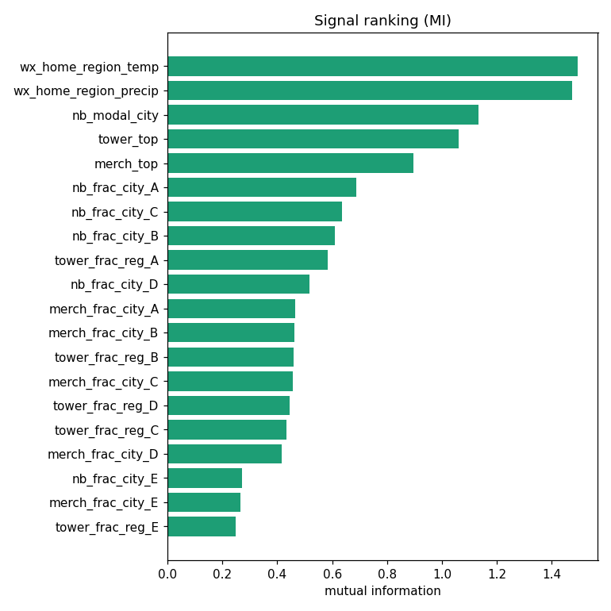
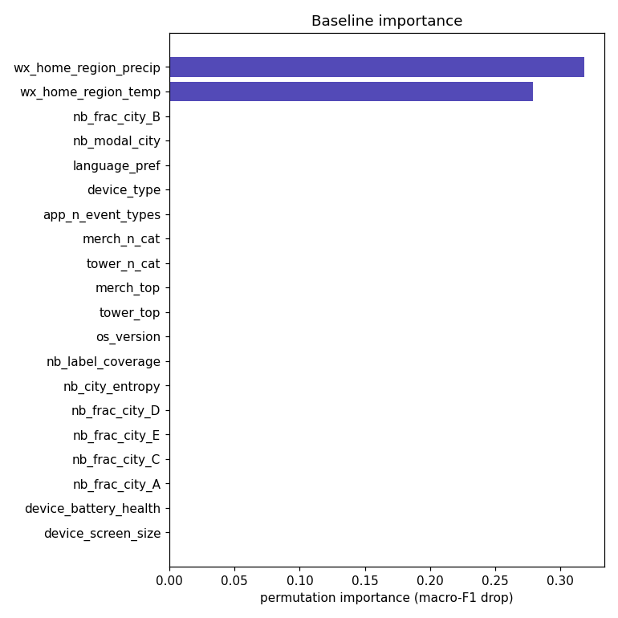
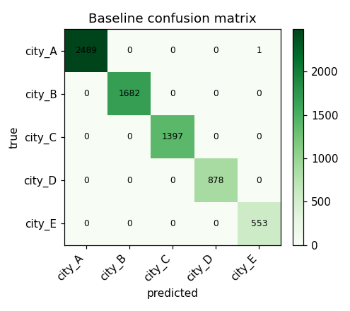
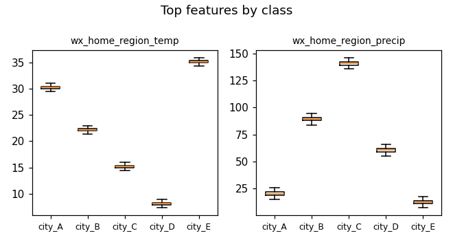
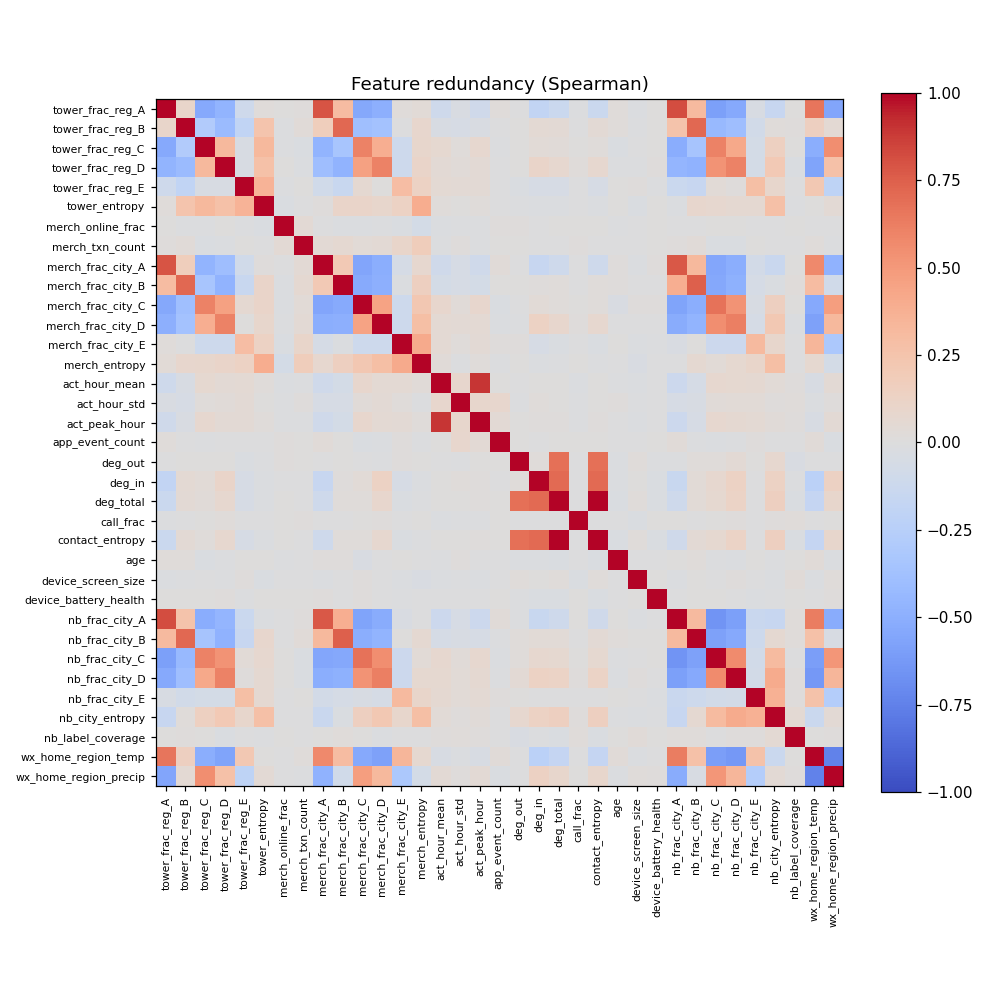

# Signal validation — home_city

- sample rows: 7,000  ·  classes: 5  ·  features: 44
- baseline (HGB): macro-F1 = 1.000, macro-AUC = 1.000
- recommendation: keep 16 · investigate 15 · drop 13

## Per-feature

| feature | recommend | reason | mi | null_p95 | beats_null | best_auc | importance | coverage | stability_cv |
|---|---|---|---|---|---|---|---|---|---|
| tower_entropy | drop | no signal over null | 0.010 | 0.010 | False | 0.552 | 0.000 | 1.000 | 0.652 |
| merch_txn_count | drop | no signal over null | 0.005 | 0.013 | False | 0.519 | 0.000 | 1.000 | 1.685 |
| deg_out | drop | no signal over null | 0.005 | 0.014 | False | 0.509 | 0.000 | 1.000 | 0.313 |
| device_screen_size | drop | no signal over null | 0.005 | 0.013 | False | 0.515 | 0.000 | 1.000 | 0.873 |
| merch_online_frac | drop | no signal over null | 0.003 | 0.015 | False | 0.519 | 0.000 | 1.000 | 2.000 |
| app_n_event_types | drop | no signal over null | 0.001 | 0.002 | False | — | 0.000 | 1.000 | 0.308 |
| act_hour_std | drop | no signal over null | 0.001 | 0.011 | False | 0.561 | 0.000 | 1.000 | 0.103 |
| os_version | drop | no signal over null | 0.001 | 0.002 | False | — | 0.000 | 1.000 | 0.401 |
| device_type | drop | no signal over null | 0.000 | 0.001 | False | — | 0.000 | 1.000 | 0.321 |
| app_event_count | drop | no signal over null | 0.000 | 0.012 | False | 0.516 | 0.000 | 1.000 | 1.399 |
| call_frac | drop | no signal over null | 0.000 | 0.013 | False | 0.507 | 0.000 | 1.000 | 1.253 |
| age | drop | no signal over null | 0.000 | 0.010 | False | 0.514 | 0.000 | 1.000 | 0.982 |
| device_battery_health | drop | no signal over null | 0.000 | 0.012 | False | 0.513 | 0.000 | 1.000 | 2.000 |
| wx_home_region_temp | investigate | suspiciously strong — check leakage | 1.493 | 0.008 | True | 1.000 | 0.279 | 1.000 | 0.006 |
| wx_home_region_precip | investigate | suspiciously strong — check leakage | 1.475 | 0.008 | True | 1.000 | 0.318 | 1.000 | 0.007 |
| nb_frac_city_A | investigate | suspiciously strong — check leakage | 0.687 | 0.014 | True | 0.977 | 0.000 | 1.000 | 0.030 |
| nb_frac_city_C | investigate | suspiciously strong — check leakage | 0.637 | 0.013 | True | 0.991 | 0.000 | 1.000 | 0.021 |
| nb_frac_city_B | investigate | suspiciously strong — check leakage | 0.610 | 0.012 | True | 0.975 | 0.000 | 1.000 | 0.042 |
| nb_frac_city_D | investigate | suspiciously strong — check leakage | 0.516 | 0.018 | True | 0.987 | 0.000 | 1.000 | 0.055 |
| tower_frac_reg_D | investigate | suspiciously strong — check leakage | 0.445 | 0.015 | True | 0.984 | 0.000 | 1.000 | 0.027 |
| tower_frac_reg_C | investigate | suspiciously strong — check leakage | 0.434 | 0.012 | True | 0.981 | 0.000 | 1.000 | 0.062 |
| nb_frac_city_E | investigate | suspiciously strong — check leakage | 0.272 | 0.011 | True | 1.000 | 0.000 | 1.000 | 0.100 |
| merch_frac_city_E | investigate | suspiciously strong — check leakage | 0.267 | 0.010 | True | 0.996 | 0.000 | 1.000 | 0.046 |
| tower_frac_reg_E | investigate | suspiciously strong — check leakage | 0.248 | 0.011 | True | 0.998 | 0.000 | 1.000 | 0.126 |
| deg_total | investigate | redundant with contact_entropy | 0.040 | 0.013 | True | 0.645 | 0.000 | 1.000 | 0.531 |
| contact_entropy | investigate | redundant with deg_total | 0.039 | 0.015 | True | 0.644 | 0.000 | 1.000 | 0.222 |
| act_hour_mean | investigate | unstable over time | 0.020 | 0.013 | True | 0.600 | 0.000 | 1.000 | 1.121 |
| nb_label_coverage | investigate | weak incremental value | 0.011 | 0.008 | True | 0.514 | 0.000 | 1.000 | 0.498 |
| nb_modal_city | keep | beats null, contributes in model | 1.132 | 0.002 | True | — | 0.000 | 1.000 | 0.017 |
| tower_top | keep | beats null, contributes in model | 1.060 | 0.002 | True | — | 0.000 | 1.000 | 0.021 |
| merch_top | keep | beats null, contributes in model | 0.896 | 0.002 | True | — | 0.000 | 1.000 | 0.014 |
| tower_frac_reg_A | keep | beats null, contributes in model | 0.585 | 0.015 | True | 0.968 | 0.000 | 1.000 | 0.009 |
| merch_frac_city_A | keep | beats null, contributes in model | 0.464 | 0.013 | True | 0.925 | 0.000 | 1.000 | 0.029 |
| merch_frac_city_B | keep | beats null, contributes in model | 0.462 | 0.015 | True | 0.920 | 0.000 | 1.000 | 0.044 |
| tower_frac_reg_B | keep | beats null, contributes in model | 0.461 | 0.011 | True | 0.960 | 0.000 | 1.000 | 0.023 |
| merch_frac_city_C | keep | beats null, contributes in model | 0.456 | 0.012 | True | 0.959 | 0.000 | 1.000 | 0.051 |
| merch_frac_city_D | keep | beats null, contributes in model | 0.416 | 0.010 | True | 0.949 | 0.000 | 1.000 | 0.024 |
| nb_city_entropy | keep | beats null, contributes in model | 0.092 | 0.011 | True | 0.648 | 0.000 | 1.000 | 0.201 |
| deg_in | keep | beats null, contributes in model | 0.065 | 0.008 | True | 0.701 | 0.000 | 0.999 | 0.214 |
| merch_entropy | keep | beats null, contributes in model | 0.031 | 0.009 | True | 0.617 | 0.000 | 1.000 | 0.713 |
| act_peak_hour | keep | beats null, contributes in model | 0.021 | 0.012 | True | 0.593 | 0.000 | 1.000 | 0.316 |
| language_pref | keep | beats null, contributes in model | 0.018 | 0.001 | True | — | 0.000 | 1.000 | 0.225 |
| merch_n_cat | keep | beats null, contributes in model | 0.014 | 0.002 | True | — | 0.000 | 1.000 | 0.237 |
| tower_n_cat | keep | beats null, contributes in model | 0.006 | 0.002 | True | — | 0.000 | 1.000 | 0.373 |

_Signal = beats shuffled-label null, has effect size, contributes incrementally in the model, and is stable. Screening only — the final word is full-model out-of-sample performance._
