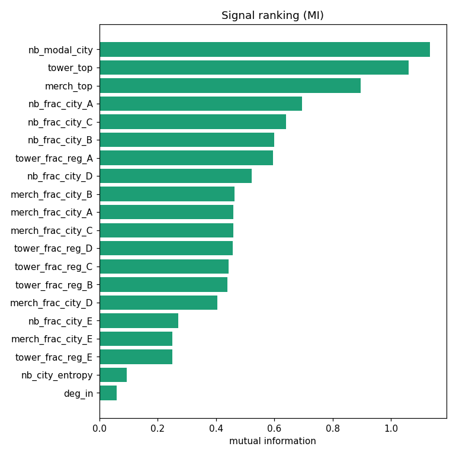
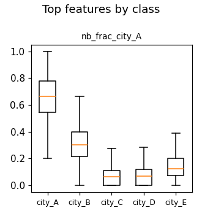
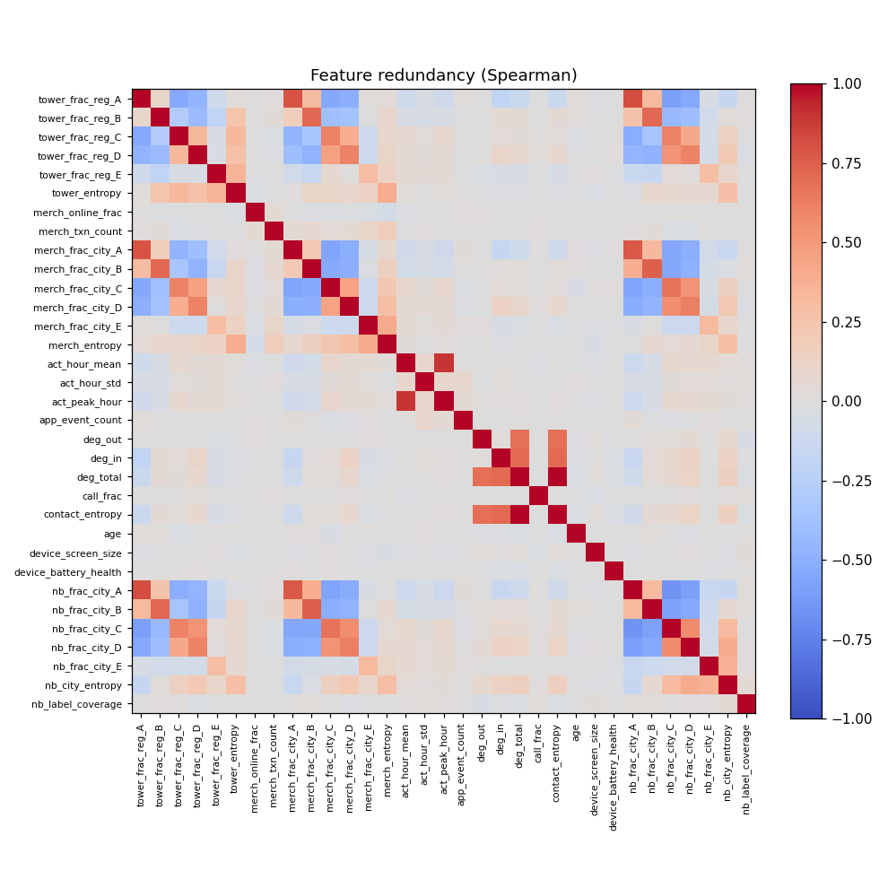

# Signal validation — home_city

- sample rows: 7,000  ·  classes: 5  ·  features: 42
- baseline (HGB): macro-F1 = 0.934, macro-AUC = 0.994
- recommendation: keep 16 · investigate 13 · drop 13

## Per-feature

| feature | recommend | reason | mi | null_p95 | beats_null | best_auc | importance | coverage | stability_cv |
|---|---|---|---|---|---|---|---|---|---|
| app_event_count | drop | no signal over null | 0.005 | 0.010 | False | 0.516 | -0.002 | 1.000 | 1.168 |
| device_battery_health | drop | no signal over null | 0.004 | 0.012 | False | 0.513 | -0.001 | 1.000 | 1.790 |
| act_peak_hour | drop | no signal over null | 0.002 | 0.012 | False | 0.593 | -0.001 | 1.000 | 1.206 |
| act_hour_std | drop | no signal over null | 0.002 | 0.011 | False | 0.561 | 0.000 | 1.000 | 0.142 |
| app_n_event_types | drop | no signal over null | 0.001 | 0.002 | False | — | -0.000 | 1.000 | 0.308 |
| os_version | drop | no signal over null | 0.001 | 0.002 | False | — | -0.001 | 1.000 | 0.401 |
| device_type | drop | no signal over null | 0.000 | 0.001 | False | — | -0.000 | 1.000 | 0.321 |
| merch_txn_count | drop | no signal over null | 0.000 | 0.011 | False | 0.519 | -0.001 | 1.000 | 0.389 |
| merch_online_frac | drop | no signal over null | 0.000 | 0.013 | False | 0.519 | -0.001 | 1.000 | 1.826 |
| deg_out | drop | no signal over null | 0.000 | 0.010 | False | 0.509 | -0.001 | 1.000 | 2.000 |
| call_frac | drop | no signal over null | 0.000 | 0.011 | False | 0.507 | 0.002 | 1.000 | 1.159 |
| age | drop | no signal over null | 0.000 | 0.012 | False | 0.514 | 0.000 | 1.000 | 2.000 |
| device_screen_size | drop | no signal over null | 0.000 | 0.011 | False | 0.515 | -0.002 | 1.000 | 0.805 |
| nb_frac_city_A | investigate | suspiciously strong — check leakage | 0.694 | 0.007 | True | 0.977 | 0.016 | 1.000 | 0.024 |
| nb_frac_city_C | investigate | suspiciously strong — check leakage | 0.640 | 0.013 | True | 0.991 | 0.014 | 1.000 | 0.030 |
| nb_frac_city_B | investigate | suspiciously strong — check leakage | 0.599 | 0.008 | True | 0.975 | 0.027 | 1.000 | 0.025 |
| nb_frac_city_D | investigate | suspiciously strong — check leakage | 0.522 | 0.012 | True | 0.987 | 0.025 | 1.000 | 0.043 |
| tower_frac_reg_D | investigate | suspiciously strong — check leakage | 0.456 | 0.010 | True | 0.984 | 0.027 | 1.000 | 0.043 |
| tower_frac_reg_C | investigate | suspiciously strong — check leakage | 0.443 | 0.010 | True | 0.981 | 0.004 | 1.000 | 0.067 |
| nb_frac_city_E | investigate | suspiciously strong — check leakage | 0.270 | 0.013 | True | 1.000 | 0.075 | 1.000 | 0.048 |
| merch_frac_city_E | investigate | suspiciously strong — check leakage | 0.251 | 0.015 | True | 0.996 | 0.004 | 1.000 | 0.081 |
| tower_frac_reg_E | investigate | suspiciously strong — check leakage | 0.250 | 0.015 | True | 0.998 | 0.005 | 1.000 | 0.093 |
| deg_total | investigate | redundant with contact_entropy | 0.035 | 0.013 | True | 0.645 | -0.000 | 1.000 | 0.459 |
| contact_entropy | investigate | redundant with deg_total | 0.028 | 0.010 | True | 0.644 | -0.000 | 1.000 | 0.518 |
| act_hour_mean | investigate | unstable over time | 0.020 | 0.016 | True | 0.600 | -0.002 | 1.000 | 1.072 |
| nb_label_coverage | investigate | unstable over time | 0.015 | 0.015 | True | 0.514 | 0.000 | 1.000 | 1.188 |
| nb_modal_city | keep | beats null, contributes in model | 1.132 | 0.002 | True | — | -0.001 | 1.000 | 0.017 |
| tower_top | keep | beats null, contributes in model | 1.060 | 0.002 | True | — | -0.001 | 1.000 | 0.021 |
| merch_top | keep | beats null, contributes in model | 0.896 | 0.002 | True | — | -0.000 | 1.000 | 0.014 |
| tower_frac_reg_A | keep | beats null, contributes in model | 0.595 | 0.012 | True | 0.968 | 0.019 | 1.000 | 0.020 |
| merch_frac_city_B | keep | beats null, contributes in model | 0.463 | 0.012 | True | 0.920 | 0.001 | 1.000 | 0.081 |
| merch_frac_city_A | keep | beats null, contributes in model | 0.460 | 0.013 | True | 0.925 | 0.002 | 1.000 | 0.019 |
| merch_frac_city_C | keep | beats null, contributes in model | 0.458 | 0.008 | True | 0.959 | 0.003 | 1.000 | 0.044 |
| tower_frac_reg_B | keep | beats null, contributes in model | 0.440 | 0.013 | True | 0.960 | 0.002 | 1.000 | 0.016 |
| merch_frac_city_D | keep | beats null, contributes in model | 0.405 | 0.014 | True | 0.949 | 0.001 | 1.000 | 0.052 |
| nb_city_entropy | keep | beats null, contributes in model | 0.094 | 0.010 | True | 0.648 | 0.002 | 1.000 | 0.308 |
| deg_in | keep | beats null, contributes in model | 0.058 | 0.011 | True | 0.701 | 0.010 | 0.999 | 0.212 |
| merch_entropy | keep | beats null, contributes in model | 0.039 | 0.010 | True | 0.617 | 0.001 | 1.000 | 0.430 |
| language_pref | keep | beats null, contributes in model | 0.018 | 0.001 | True | — | 0.001 | 1.000 | 0.225 |
| merch_n_cat | keep | beats null, contributes in model | 0.014 | 0.002 | True | — | -0.001 | 1.000 | 0.237 |
| tower_entropy | keep | beats null, contributes in model | 0.012 | 0.009 | True | 0.552 | 0.002 | 1.000 | 0.735 |
| tower_n_cat | keep | beats null, contributes in model | 0.006 | 0.002 | True | — | -0.000 | 1.000 | 0.373 |

_Signal = beats shuffled-label null, has effect size, contributes incrementally in the model, and is stable. Screening only — the final word is full-model out-of-sample performance._
